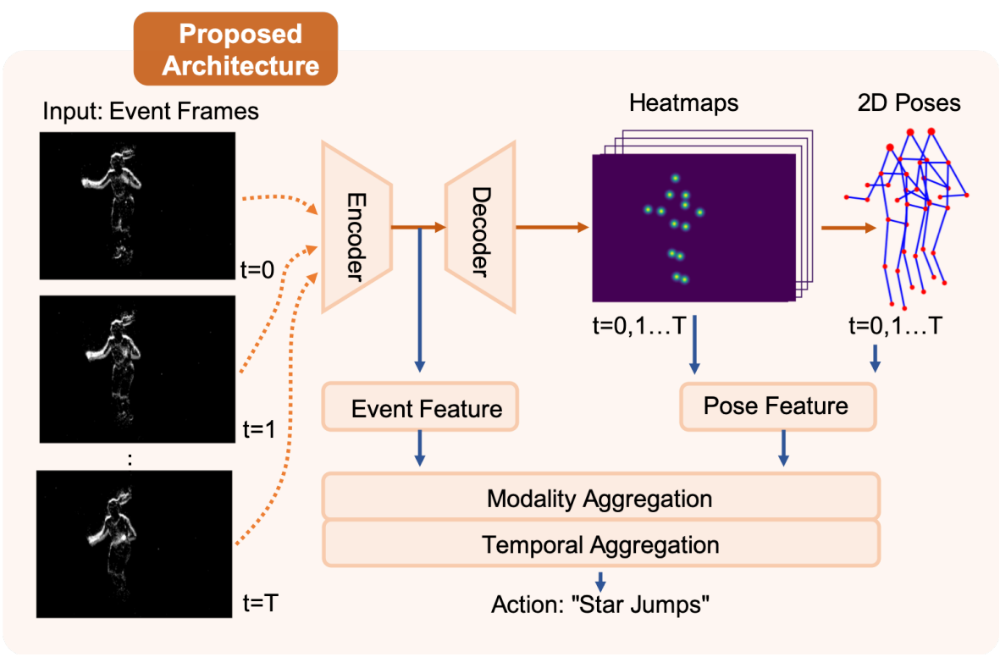
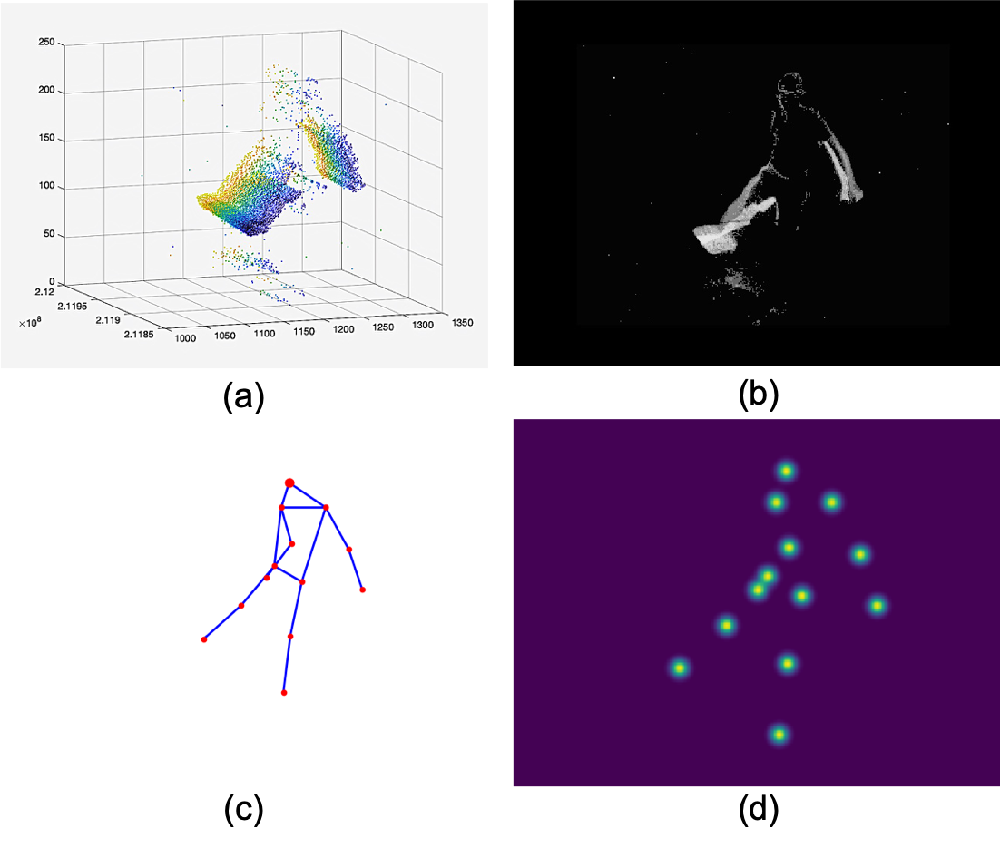

<p>
  
</p>


[[PDF]](https://ieeexplore.ieee.org/document/9221355)

The implementation of Multipath Event-Based Network for Low-Power Human Action Recognition (WFIoT 2020). 

# Introduction
Event-based cameras are bio-inspired sensors capturing asynchronous per-pixel brightness changes (events), which have the advantages of high temporal resolution and low power consumption compared with traditional frame-based cameras. 

We propose a multipath deep neural network for action recognition
based on event camera outputs. Extensive experiments verify the effectiveness of the proposed model with a recognition accuracy of 85.91% on the DHP19 dataset.

<p>
  
</p>


# Installation

This repository uses PyTorch, which can be installed by following commands.
```sh
conda install pytorch torchvision torchaudio cudatoolkit=10.2 -c pytorch
```

# Dataset 

## Offical Dataset
The offical DHP19 dataset is avaiable [here](https://sites.google.com/view/dhp19/home).

## Preprocessing
After downloading, Matlab scripts are used to pre-process the event data as in `matlab/DHP19/generate_DHP19/Generate_DHP19.m`​. This script will generate a bunch of event data ended with `.h5`​​. Then `src/dataset/pose7500.py`​ is used to turn `.h5`​ files into `.npy`​ files for faster dataset load. 


